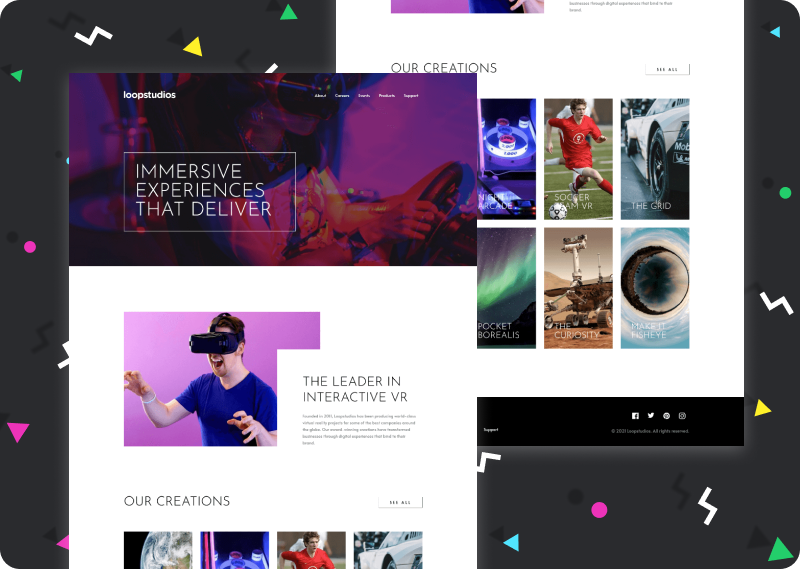

# Frontend Mentor - Loopstudios landing page solution

This is a solution to the [Loopstudios landing page challenge on Frontend Mentor](https://www.frontendmentor.io/challenges/loopstudios-landing-page-N88J5Onjw). Frontend Mentor challenges help you improve your coding skills by building realistic projects.

## Table of contents

-   [Overview](#overview)
    -   [The challenge](#the-challenge)
    -   [Screenshot](#screenshot)
    <!-- -   [Links](#links) -->
-   [My process](#my-process)
    -   [Built with](#built-with)
    -   [What I learned](#what-i-learned)
-   [Author](#author)
-   [Acknowledgments](#acknowledgments)

## Overview

### The challenge

Users should be able to:

-   View the optimal layout for the site depending on their device's screen size
-   See hover states for all interactive elements on the page

### Screenshot



### Links

<!--
-   Solution URL: [Add solution URL here](https://your-solution-url.com) -->

-   Live Site URL: [Github Page](https://javieer57.github.io/FEM-loopstudios-landing-page/)

## My process

### Built with

-   Semantic HTML5 markup
-   CSS custom properties
-   CSS Grid
-   [SASS](https://sass-lang.com/) - CSS Preprocessor
<!-- -   Mobile-first workflow -->

### What I learned

To add the filter on hover in the projects first I tried to add the `filter` property to the entire element but that affected the title too. So, I added a `::before` pseudo-element to make that effect keeping simple the HTML code.

```html
<a href="javascript:;" class="project" id="soccer">
	<h3 class="project__title title-24 title--sm-32">Soccer team VR</h3>
</a>
```

```scss
.project {
	height: 450px;
	position: relative;
	color: var(--white);
	background-size: cover;
	background-repeat: no-repeat;

	&::before {
		position: absolute;
		content: "";
		top: 0;
		left: 0;
		width: 100%;
		height: 100%;
		transition: all 0.15s ease-in-out;
	}

	&:hover {
		&::before {
			background: hsla(0, 0%, 100%, 0.75);
		}
	}
}

#soccer {
	background-image: url(/images/desktop/image-soccer-team.jpg);
}
```

## Author

-   Frontend Mentor - [@Javieer57](https://www.frontendmentor.io/profile/Javieer57)
-   Github - [@Javieer57](https://github.com/Javieer57)
-   Codepen - [@Javieer57](https://codepen.io/Javieer57)
-   Instagram - [@javieer_eufracio](https://www.instagram.com/javieer_eufracio/)

## Acknowledgments

I wasn't sure about how to make the animations for the navigation links. So, I saw the solution of [@russo97](https://www.frontendmentor.io/profile/russo97). It looks good, so I took hi's keyframes to make my links have that smooth animation.
